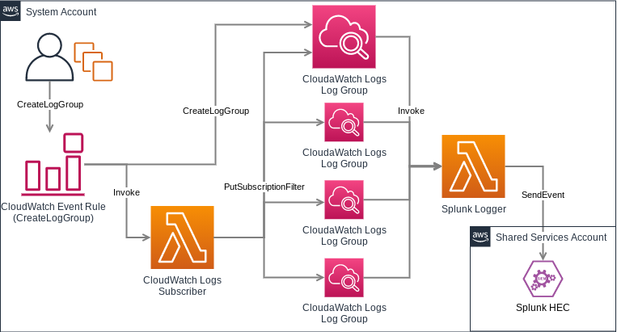

# cloudwatch-logs-automator
Automate delivery of new and existing CloudWatch Logs to Splunk

## Kudos
This is a Python rewrite of the SumoLogic LogGroup Connector:
https://github.com/SumoLogic/sumologic-aws-lambda/tree/main/loggroup-lambda-connector

## Splunk AWS Serverless App
This service uses the Splunk CloudWatch Logs Processor:
https://github.com/splunk/splunk-aws-serverless-apps/tree/master/splunk-cloudwatch-logs-processor

## Architecture

